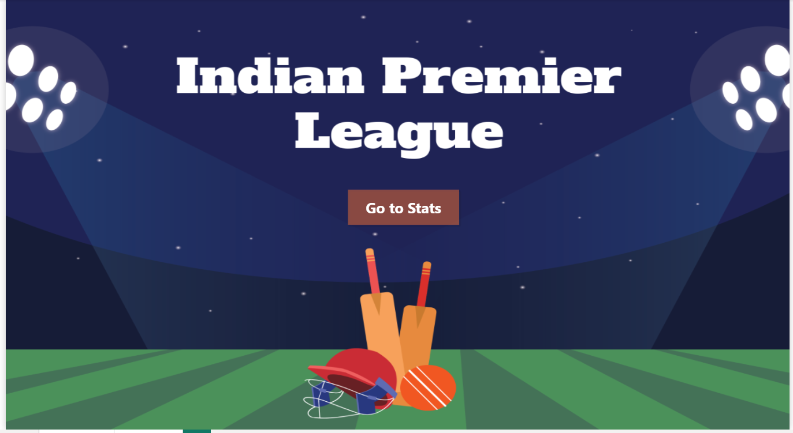
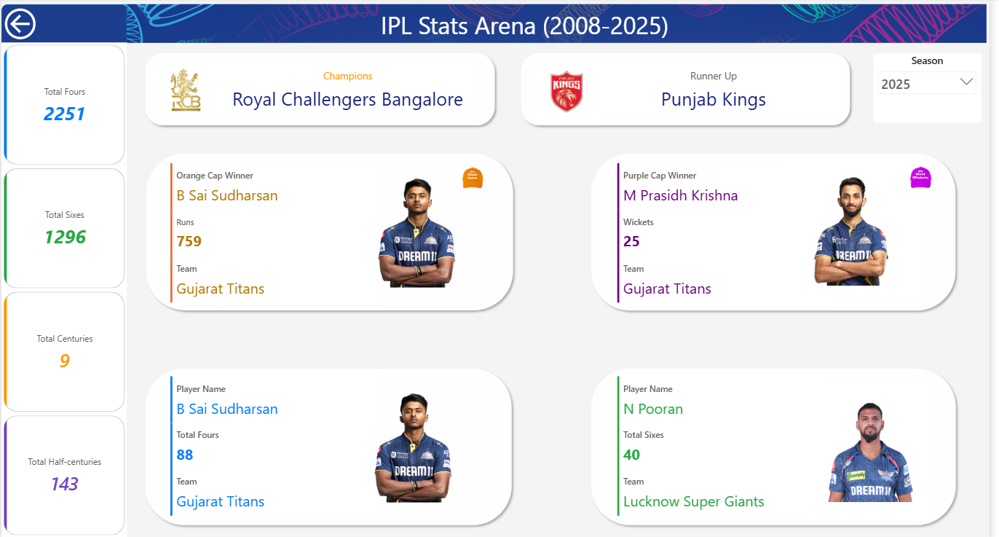

# 🏏 IPL Stats Arena (2008–2025) – Power BI Dashboard  

## Project Overview  
The **IPL Stats Arena Dashboard** is an interactive Power BI report that showcases season-wise insights from the Indian Premier League (2008–2025).  
It highlights **team achievements** and **individual player performances**, providing a quick snapshot of each season in a clean, engaging format.  

---

## Dashboard Highlights  
✔️ **Season KPIs** – Total fours, sixes, centuries, and half-centuries  
✔️ **Team Achievements** – Champions & Runner-up of each season  
✔️ **Player Awards** – Orange Cap, Purple Cap, Most Fours, Most Sixes  
✔️ **Interactive Filters** – Select any season (2008–2025) to update stats dynamically  
✔️ **Minimalist Design** – Consistent color coding, KPI cards, and player visuals  

---

## 🖼️ Dashboard Preview

### Home Dashboard

### Stats Dashboard Section

---

## Skills Demonstrated  
- Power BI – Data modeling, DAX measures, and interactive visuals  
- Data Cleaning – Preprocessing raw IPL data for analysis  
- Dashboard Design – KPI-driven storytelling with consistent layout  
- Data Visualization – Turning raw numbers into actionable insights  

---

## Key Learnings  
- Translating **sports data** into a business-style dashboard  
- Designing **insightful KPIs** for quick decision-making  
- Building **season-level interactivity** in Power BI  

